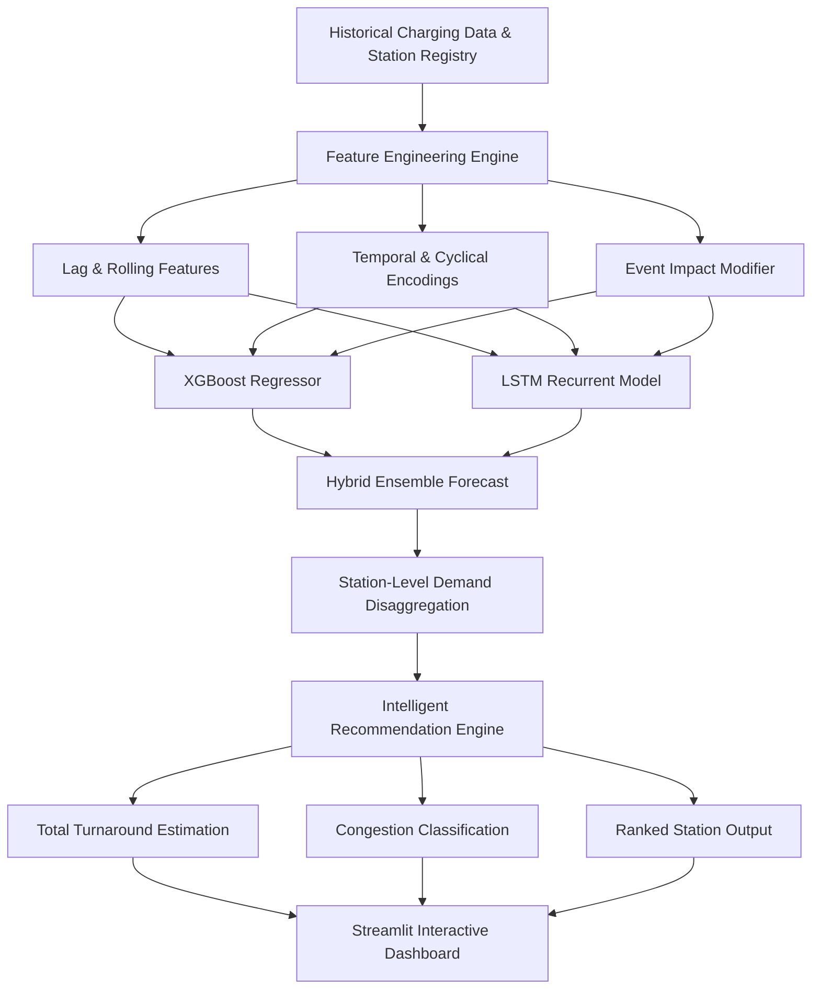

# ⚡ Kavali EV Charging Demand Forecasting & Intelligent Station Recommendation

[](https://ev-charging-demand-intelligence.streamlit.app/)
[](https://www.python.org/)
[](https://streamlit.io/)
[](https://xgboost.readthedocs.io/)
[](https://www.tensorflow.org/)
[](LICENSE)

🌐 **Live Demo:** [https://ev-charging-demand-intelligence.streamlit.app/](https://ev-charging-demand-intelligence.streamlit.app/)

An AI-powered EV charging intelligence system that forecasts charging demand and recommends the best EV charging station based on predicted congestion, charger power, estimated waiting time, and charging duration.

---

## 🚗 What This Project Does

The system is designed around a practical EV-user problem:

> **“Which charging station should I go to right now?”**

It combines demand forecasting with station-level intelligence to rank available charging stations and identify the most suitable option in real time.

### 🔮 Demand Forecasting
- **24-hour ahead EV charging demand forecasting** at city and station levels.
- **Hourly demand prediction** capturing peak vs. off-peak commute patterns.
- **Time-series feature engineering** (lags, rolling averages, cyclically encoded timestamps, calendar flags).
- **Trend and seasonality awareness** reflecting diurnal and weekly cycles.
- **Event-aware demand adjustment** (festivals, holiday rushes, special local events).

### 🤖 Machine Learning
- **XGBoost Regressor**: Captures nonlinear relationships and complex engineered temporal features.
- **LSTM (Long Short-Term Memory)**: Models sequential temporal dependencies and multi-step dynamics.
- **Hybrid XGBoost + LSTM Ensemble**: Combines gradient boosting with deep sequence models for accurate, robust demand forecasts.
- **Chronological Time-Series Validation**: Strict temporal train/test splitting to prevent data leakage.

### 📍 Intelligent Station Recommendation
The system compares charging stations using:
- **Predicted Demand (kWh)** across upcoming hours
- **Predicted Congestion Status** (Low, Moderate, High, Severe)
- **Charger Rated Power (kW)** & connector compatibility
- **Estimated Waiting Time (min)** derived from queue demand
- **Estimated Charging Time (min)** calculated from EV battery target requirements
- **Total Turnaround Time (min)**: `Wait Time + Charging Time`

It then delivers:
- 🥇 **Best Recommended Station**: Optimal total turnaround time.
- 🥈 **Alternative Stations**: Nearby ranked choices with trade-off indicators.
- ⚡ **Fastest Charger**: Station with highest kW output for urgent charging.
- 🟢 **Predicted Congestion Status**: Clear, actionable bottleneck alerts.
- 📈 **Next-Hours and 24-Hour Demand Forecasts**: Interactive trend curves with confidence bands.

---

## 🖥️ Dashboard & Features

The web application is built with **Streamlit** and features a modern dark-mode interface structured into 5 dedicated modules:

| Tab | Feature | Description |
|---|---|---|
| 🚗 **Find Station** | User Decision Hub | Input your target charging kWh and departure time to receive ranked station recommendations with waiting times and congestion warnings. |
| 📈 **24-Hour Forecast** | Demand Projections | City-wide and station-specific demand curves for the next 24 hours, comparing historical baselines against forecasts. |
| 📍 **Stations** | Station Intelligence | Detailed breakdown of each charging hub: charger speeds, connector types, peak usage hours, and capacity utilization. |
| 📊 **Analytics** | Historical Insights | Session duration distribution, energy consumption trends, peak hour heatmaps, and weekday vs. weekend patterns. |
| 🧠 **Model & Methodology** | Evaluation & Transparency | Model metric comparison (MAE, RMSE, R² for XGBoost vs. LSTM vs. Hybrid), feature importances, and residual analysis. |

---

## 🏗️ Architecture & Pipeline



---

## 🧰 Tech Stack

- **Core & Runtime**: Python 3.10+
- **Data Manipulation & Analysis**: Pandas, NumPy
- **Machine Learning**: Scikit-learn, XGBoost
- **Deep Learning**: TensorFlow / Keras (LSTM)
- **Data Visualization**: Plotly, Streamlit Components
- **Web Dashboard**: Streamlit (Custom Responsive Dark UI)

---

## 📊 Dataset & Schema

The current prototype is calibrated on a **synthetic Kavali EV charging dataset** covering one full year of hourly charging activity across multiple charging hubs.

### Files Included:
- `kavali_ev_hourly_usage_synthetic.csv`: Aggregate city/station hourly usage logs (kWh, active sessions).
- `kavali_ev_sessions_synthetic_Oct2025-Sep2026.csv`: Individual session records (start time, end time, energy delivered, station ID).
- `kavali_ev_stations.csv`: Station registry (station ID, location name, charger count, power ratings in kW).
- `events_template.csv`: Optional event injection file to model holidays, festivals, or local traffic spikes.

### Event CSV Schema:
```csv
date,event_name,event_type,impact_pct,start_hour,end_hour
2026-10-15,Festival Rush,Public Holiday,25,10,20
```
> *`impact_pct` allows testing explicit "what-if" operational scenarios.*

> **Note:** The dataset is synthetic and demonstrates the forecasting and recommendation architecture. The current system should not be interpreted as providing live real-world station availability.

---

## ⚙️ Installation & Quick Start

### 1. Clone the repository
```bash
git clone https://github.com/bharghavareddy615/EV-Charging.git
cd EV-Charging
```

### 2. Create and activate a virtual environment
```bash
# Windows
python -m venv .venv
.venv\Scripts\activate

# macOS / Linux
python3 -m venv .venv
source .venv/bin/activate
```

### 3. Install dependencies
```bash
pip install -r requirements.txt
```

### 4. Run the Streamlit application
```bash
streamlit run app.py
```
Open your browser at `http://localhost:8501`.

---

## 📁 Project Directory Structure

```text
├── app.py                                            # Main Streamlit application & ML pipeline
├── requirements.txt                                  # Python dependencies
├── kavali_ev_hourly_usage_synthetic.csv             # Synthetic hourly charging demand data
├── kavali_ev_sessions_synthetic_Oct2025-Sep2026.csv  # Synthetic charging session transaction logs
├── kavali_ev_stations.csv                           # Charging station metadata and specifications
├── events_template.csv                               # Template for event-based scenario adjustments
├── README.md                                         # Project documentation
└── .streamlit/
    └── config.toml                                   # Streamlit visual theme configuration
```

---

## 🚀 Future Improvements

- **Real-time station availability** via live OCPP (Open Charge Point Protocol) or commercial charging-network APIs.
- **Live queue estimation** integrating hardware sensors and IoT ingress streams.
- **GPS-based routing & radius recommendations** factoring in driver location and live traffic delay.
- **Time-of-Use (ToU) dynamic tariff pricing integration** to recommend cost-optimal charging windows.
- **Weather features integration** (ambient temperature impacts on battery charging curves).
- **Vehicle-specific battery charging curve simulation** (CC-CV charging profile rather than linear charging speed).
- **Production cloud deployment** with automated continuous model retraining.

---

## 📜 License & Disclaimers

Distributed under the MIT License. See `LICENSE` for more information.

*Disclaimer: This project was developed as an intelligent decision-support system prototype. Real-world commercial deployment requires direct integration with certified charge point operator (CPO) APIs and live telemetry feeds.*
